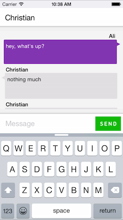
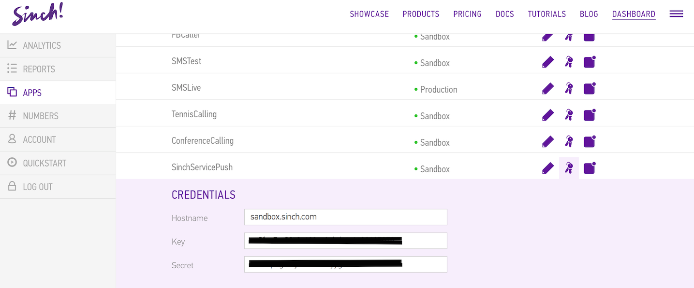
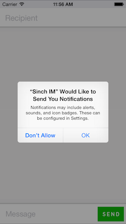
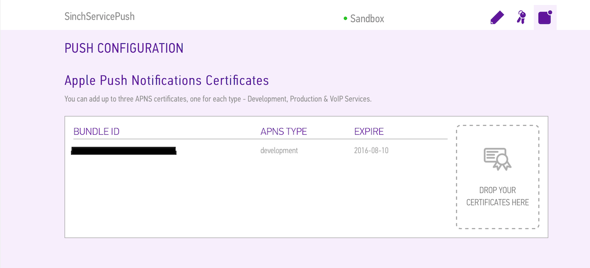
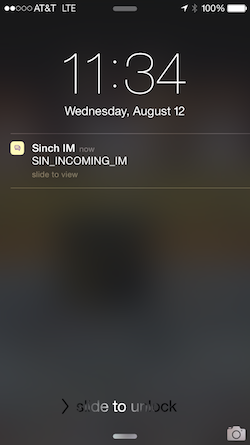
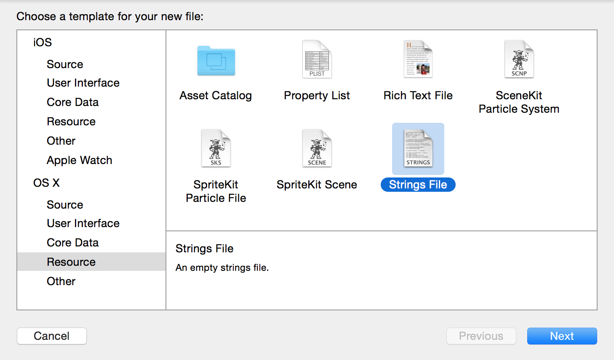
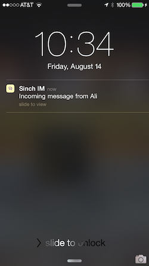

# iOS Instant Messaging using SinchService

In this tutorial, we'll be implementing [Sinch Instant Messaging](https://www.sinch.com/products/instant-messaging/) using SinchService. SinchService is a simple and compact way to use Sinch features such as voice calling, instant messaging, and managed push. I'm going to dive right in, but I recommend that you first check out Jordan Morgan's [tutorial](https://www.sinch.com/tutorials/ios-push-notifications-tutorial/) on iOS push notifications using SinchService. It gives a great intro to SinchService and talks about why SinchService is convenient.

To get the most out of this tutorial, it will help to be familiar with:

* XCode
* Objective-C
* CocoaPods

  

## 1. Setup

Go ahead and create an app in your [Sinch Dashboard](https://www.sinch.com/dashboard/). Be sure to take note of your application key and secret. We'll need those later.



There's a starter project that you can download from [Github](https://github.com/sinch/ios-im-with-sinchservice). Once you've downloaded that, take a quick look at the project just to get a feel for what we'll be working with.

The starter app has two view controllers. One is for the login, and the other is for instant messages. The instant message controller, MainViewController, has a UI that's customized in files like **MainViewController+UI.m**. We won't be touching those today, but they offer a nice foundation for what we want. The messages themselves will be in a [UITabelView](https://developer.apple.com/library/ios/documentation/UIKit/Reference/UITableView_Class/. Each message will be displayed as a cell object belonging to the class "MessageTableViewCell". This class is just a child of [UITableViewCell](https://developer.apple.com/library/ios/documentation/UIKit/Reference/UITableViewCell_Class/index.html#//apple_ref/occ/cl/UITableViewCell). It has a [UITextView](https://developer.apple.com/library/ios/documentation/UIKit/Reference/UITextView_Class/) and [UILabel](https://developer.apple.com/library/ios/documentation/UIKit/Reference/UILabel_Class/) for displaying a message and its sender respectively.

The starter project has a Podfile included. Install the Sinch pod by navigating to the project directory in "Terminal" and typing `pod install`. This will install the "SinchRTC" and "SinchService" pods. Now there should be an XCode workspace that you can use.

## 2. Using SinchService

Let's start in **AppDelegate.h**. Go ahead and add the following imports:

```objective-c
#import <Sinch/Sinch.h>
#import <SinchService/SinchService.h>
```

Next, add the following property:

```objective-c
@property (strong, nonatomic) id<SINService> sinch;
```

This is the SinchService property, of type SINService, that we'll use to handle messaging, and later push notifications.

Now go to **AppDelegate.m**. Start by adding the following lines before the implementation to ensure that AppDelegate has the protocol needed to make it a SinchService delegate.

```objective-c
@interface AppDelegate () <SINServiceDelegate>
@end
```

Then, add the following code to the `application:didFinishLaunchingWithOptions:` method:

```objective-c
id config = [SinchService configWithApplicationKey:@"<YOUR_APP_KEY>"
                                     applicationSecret:@"<YOUR_APP_SECRET>"
                                       environmentHost:@"sandbox.sinch.com"];
    
id<SINService> sinch = [SinchService serviceWithConfig:config];
sinch.delegate = self;
    
void (^onUserDidLogin)(NSString *) = ^(NSString *userId) {
    [sinch logInUserWithId:userId];
};
    
self.sinch = sinch;
    
[[NSNotificationCenter defaultCenter]
	addObserverForName:@"UserDidLoginNotification"
	object:nil
	queue:nil
	usingBlock:^(NSNotification *note) { onUserDidLogin(note.userInfo[@"userId"]); }];
```

You can go ahead and fill in your app key and secret from earlier.

Let's take a look at what we just did. First, we specify the configuration that we want for implementing Sinch (i.e. our app key, secret, and environment). Next, we initialize a SinchService variable, "sinch", with our new configuration. We then set the delegate for "sinch" to AppDelegate. This will help with debugging. Finally, we wrap it up by setting our SinchService property and using NSNotificationCenter. We'll use NSNotificationCenter to log the user in. 

Next, add the following SinchService delegate methods to **AppDelegate.m**:

```objective-c
#pragma mark - SINServiceDelegate

- (void)service:(id<SINService>)service didFailWithError:(NSError *)error {
    NSLog(@"%@", [error localizedDescription]);
}

- (void)service:(id<SINService>)service
     logMessage:(NSString *)message
           area:(NSString *)area
       severity:(SINLogSeverity)severity
      timestamp:(NSDate *)timestamp {
    if (severity == SINLogSeverityCritical) {
        NSLog(@"%@", message);
    }
}
```

To log the user in, go to **LoginViewController.m** and find the method `onLoginButtonPressed:`. Add the following code after the if-statement:

```objective-c
[[NSNotificationCenter defaultCenter] postNotificationName:@"UserDidLoginNotification"
                                                    object:nil
                                                  userInfo:@{@"userId" : self.nameTextField.text}];
```

## 3. Handling Messages

Now let's take care of sending and receiving messages. Go to **MainViewController.h** and add the following import:

```objective-c
#import <Sinch/Sinch.h>
```

Next, add the "SINMessageClientDelegate" protocol to the interface to allow messages to be sent and received in MainViewController:

```objective-c
@interface MainViewController : UIViewController <SINMessageClientDelegate, UITableViewDataSource, UITableViewDelegate>
```

Now head over to **MainViewController.m**. We'll need a way to access the message client property of our SinchService variable from AppDelegate. We can do this by adding the following to the implementation:

```objective-c
- (id<SINMessageClient>)messageClient {
    return [[(AppDelegate *)[[UIApplication sharedApplication] delegate] sinch] messageClient];
}
```

To set the message client's delegate right when MainViewController is loaded, add this line to the method `awakeFromNib`

```objective-c
[self messageClient].delegate = self;
```

Next, let's send a message whenever the user presses the send button. Find the method `sendButtonPressed:` and add the following two lines after the if-statement:

```objective-c
SINOutgoingMessage *message = [SINOutgoingMessage messageWithRecipient:destination text:text];
[[self messageClient] sendMessage:message];
```

Now let's work with some of the delegate methods for the message client. Under the pragma mark labeled `#pragma mark - SINMessageClientDelegate`, you'll find the method `messageClient:didReceiveIncomingMessage:`. Add the following lines:

```objective-c
[_messages addObject:@[ message, @(Incoming) ]];
[self.messageView reloadData];
[self scrollToBottom];
```

Here, we add the message to our message view's array, label it as "Incoming", reload the view data, and scroll to the bottom. We can do the same thing for sent messages too. just under `messageClient:didReceiveIncomingMessage:`, you'll find the method `messageSent:recieptId:`. Add these lines:

```objective-c
[_messages addObject:@[ message, @(Outgoing) ]];
[self.messageView reloadData];
[self scrollToBottom];
```

If you implement Sinch IM in your own project, it's a good idea to make changes to the UI in these two methods, as you'll know right when a message is sent or received. 

Now we can set the message text and sender for the UI. Find the method `tableView:cellForRowAtIndexPath:`. Here, you'll notice that we first get the SINMessage object for a particular row in the UITableView. After that, we dequeue a cell from the message view and store it in a MessageTableVieCell called "cell". Let's go ahead and add the message text and sender Id to the cell. Add the following lines before the return-statement:

```objective-c
cell.message.text = message.text;
cell.nameLabel.text = message.senderId;
```

As you can see, working with Sinch messages is pretty straightforward. SINMessage objects have properties for a message's text and sender, so you can get NSStrings straight from those.

Go ahead and test it out. You should be able to send and receive messages after logging in.

## 4. Push with SinchService

Now let's add push notification support to our app. As I mentioned earlier, there's a great [tutorial](https://www.sinch.com/tutorials/ios-push-notifications-tutorial/) that focuses on iOS push notifications using SinchService that you should definitely check out.



Once you've created and downloaded the appropriate push certificate on [Apple's Developer Website](https://developer.apple.com/membercenter/index.action), export it as a .p12 file and drag it to your Sinch App in your [Dashboard](https://www.sinch.com/dashboard/) under the certificate section.



Now, let's go back to **AppDelegate.m** and add some code. Find the method `application:didFinishLaunchingWithOptions:` and add these two lines to the block "onUserDidLogin":

```objective-c
[sinch.push setDesiredPushTypeAutomatically];
[sinch.push registerUserNotificationSettings];
```

Now the app will request the user's permission to use push notifications.

We'll need to configure our SinchService object to recognize push notifications. Let's change how we declare the "config" variable so that it looks like this:

```objective-c
id config = [[SinchService configWithApplicationKey:@"<YOUR_APP_KEY>"
                                  applicationSecret:@"<YOUR_APP_SECRET>"
                                    environmentHost:@"sandbox.sinch.com"]
             pushNotificationsWithEnvironment:SINAPSEnvironmentAutomatic];
```

Then, add the following methods to the file in order to handle push notifications:

```objective-c
#pragma mark - push

- (void)application:(UIApplication *)application
didRegisterForRemoteNotificationsWithDeviceToken:(NSData *)deviceToken {
    [self.sinch.push application:application didRegisterForRemoteNotificationsWithDeviceToken:deviceToken];
}

- (void)application:(UIApplication *)application didReceiveRemoteNotification:(NSDictionary *)userInfo {
    [self.sinch.push application:application didReceiveRemoteNotification:userInfo];
}

- (void)application:(UIApplication *)application didFailToRegisterForRemoteNotificationsWithError:(NSError *)error {
    NSLog(@"%@:%@", NSStringFromSelector(_cmd), error);
}
```

Test it out and see if push notifications are working. Note that push notification will only work on devices. If you're using a simulator, try sending a push message from your simulator to your device.



Now that you know push works, let's fix that notification message. You don't want the user to see "SIN_INCOMING_IM" every time right?

Go to **LoginViewController.m**. In `onLoginButtonPressed:`, add the following two lines before the segue `[self performSegueWithIdentifier:@"mainView" sender:nil];`:

```objective-c
id<SINManagedPush> push = [[(AppDelegate *)[[UIApplication sharedApplication] delegate] sinch] push];
[push setDisplayName:self.nameTextField.text];
```

`setDisplayName:` is a neat method for setting the user's name. This adds a localized argument when sending a push notification, and makes it easier to work with push.

If you try push again, you won't get a great result. In fact, now it should say "SIN_INCOMING_IM_DISPLAY_NAME". We're getting there though. To change what the localization key for our push notifications say, we need to first add a ".strings" file to our project. You can do that by going to File>New>File... and choosing a string file under the "Resources" category. Make sure to name it "Localizable".



Once that file is in you project, simple open it add the following line:

```
"SIN_INCOMING_IM_DISPLAY_NAME" = "Incoming message from %@";
```

Give it a spin. You should get a pretty sweet looking push notification!



There you have it! You've implemented Sinch Instant Messaging with push. For your convenience, I've also put a final version of this project up on [Github](https://github.com/sinch/ios-im-with-sinchservice).

For more tutorials like this, be sure to check out the [Sinch Tutorial Site](https://www.sinch.com/tutorials/) and [Sinch's Github](https://github.com/sinch).