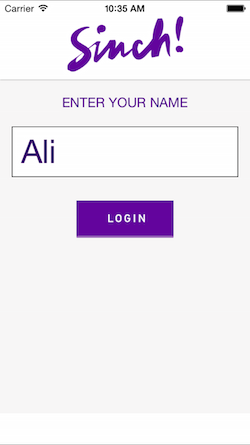

# iOS Instant Messaging using SinchService

In this tutorial, we'll be implementing [Sinch Instant Messaging](https://www.sinch.com/products/instant-messaging/) using SinchService. SinchService is a simple and compact way to use Sinch features such as voice calling, instant messaging, and managed push. I'm going to dive right in, but I recommend that you first check out Jordan Morgan's [tutorial](https://www.sinch.com/tutorials/ios-push-notifications-tutorial/) on iOS push notifications using SinchService. It gives a great intro to SinchService and talks about why SinchService is convenient.

To get the most out of this tutorial, it will help to be familiar with:

* XCode
* Objective-C
* CocoaPods

  

## 1. Setup

Go ahead and create an app in your [Sinch Dashboard](https://www.sinch.com/dashboard/). Be sure to take note of your application key and secret. We'll need those later.


There's a starter project that you can download from [Github](https://github.com/sinch/ios-im-with-sinchservice). Once you've downloaded that, take a quick look at the project just to get a feel for what we'll be working with. Don't worry if you don't understand all of it.

The starter project has a Podfile included. Install the Sinch pod by typing `pod install`. This will install the "SinchRTC" and "SinchService" pods. Now there should be an XCode workspace that you can use.

## 2. Using SinchService

Let's start at **AppDelegate.h**. Go ahead and add the following imports:

```objective-c
#import <Sinch/Sinch.h>
#import <SinchService/SinchService.h>
```

Next, add the following property:

```objective-c
@property (strong, nonatomic) id<SINService> sinch;
```

This is the SinchService property, of type SINService, that we'll use to handle messaging, and later push notifications.

Now go to **AppDelegate.m**. Start by adding the following lines before the implementation to ensure that AppDelegate has the protocol needed to make it a SinchService delegate.

```objective-c
@interface AppDelegate () <SINServiceDelegate>
@end
```

Then, add the following code to the `application:didFinishLaunchingWithOptions:` method:

```objective-c
id config = [SinchService configWithApplicationKey:@"<YOUR_APP_KEY>"
                                     applicationSecret:@"<YOUR_APP_SECRET>"
                                       environmentHost:@"sandbox.sinch.com"];
    
id<SINService> sinch = [SinchService serviceWithConfig:config];
sinch.delegate = self;
    
void (^onUserDidLogin)(NSString *) = ^(NSString *userId) {
    [sinch logInUserWithId:userId];
};
    
self.sinch = sinch;
    
[[NSNotificationCenter defaultCenter]
	addObserverForName:@"UserDidLoginNotification"
	object:nil
	queue:nil
	usingBlock:^(NSNotification *note) { onUserDidLogin(note.userInfo[@"userId"]); }];
```

You can go ahead and fill in your app key and secret from earlier.

Let's take a look at what we just did. First, we specify the configuration that we want for implementing Sinch (i.e. our app key, secret, and environment). Next, we initialize a SinchService variable, "sinch", with our new configuration. We then set the delegate for "sinch" to AppDelegate. This will help with debugging. Finally, we wrap it up by setting our SinchService property and using NSNotificationCenter. We'll use NSNotificationCenter to log the user in. 

Next, add the following SinchService delegate methods to **AppDelegate.m**:

```objective-c
#pragma mark - SINServiceDelegate

- (void)service:(id<SINService>)service didFailWithError:(NSError *)error {
    NSLog(@"%@", [error localizedDescription]);
}

- (void)service:(id<SINService>)service
     logMessage:(NSString *)message
           area:(NSString *)area
       severity:(SINLogSeverity)severity
      timestamp:(NSDate *)timestamp {
    if (severity == SINLogSeverityCritical) {
        NSLog(@"%@", message);
    }
}
```

To log the user in, go to **LoginViewController.m** and find the method `onLoginButtonPressed:`. Add the following code after the if-statement:

```objective-c
[[NSNotificationCenter defaultCenter] postNotificationName:@"UserDidLoginNotification"
                                                    object:nil
                                                  userInfo:@{@"userId" : self.nameTextField.text}];
```

## 3. Handling Messages

Now let's take care of sending and receiving messages. Go to **MainViewController.h** and add the following import:

```objective-c
#import <Sinch/Sinch.h>
```

Next, add the "SINMessageClientDelegate" protocol to the interface to allow messages to be sent and received in MainViewController:

```objective-c
@interface MainViewController : UIViewController <SINMessageClientDelegate, UITableViewDataSource, UITableViewDelegate>
```

Now head over to **MainViewController.m**. We'll need a way to access the message client property of our SinchService variable from AppDelegate. We can do this by adding the following to the implementation:

```objective-c
- (id<SINMessageClient>)messageClient {
    return [[(AppDelegate *)[[UIApplication sharedApplication] delegate] sinch] messageClient];
}
```

To set the message client's delegate right when MainViewController is loaded, add this line to the method `awakeFromNib`

```objective-c
[self messageClient].delegate = self;
```

Next, let's send a message whenever the user presses the send button. Find the method `sendButtonPressed:` and add the following two lines after the if-statement:

```objective-c
SINOutgoingMessage *message = [SINOutgoingMessage messageWithRecipient:destination text:text];
[[self messageClient] sendMessage:message];
```

Simple right? The message client delegate methods have already been added for you, denoted by a pragma mark. If you implement Sinch IM in a project of your own, it's a good idea to make changes to the UI here, as you'll know right when a message is sent or received.

I should also mention that working with incoming messages is pretty simple too. SINMessage objects have a text property, so you can get a message's text string straight from that.

Go ahead and test it out. You should be able to send and receive messages after logging in.

## 4. Push with SinchService

Now let's add push notification support to our app. As I mentioned earlier, there's a great [tutorial](https://www.sinch.com/tutorials/ios-push-notifications-tutorial/) that focuses on iOS push notifications using SinchService that you should definitely check out.


Once you've created and downloaded the appropriate push certificate on [Apple's Developer Website](https://developer.apple.com/membercenter/index.action), export it as a .p12 file and drag it to your Sinch App in your [Dashboard](https://www.sinch.com/dashboard/) under the certificate section.


Now, let's go back to **AppDelegate.m** and add some code. Find the method `application:didFinishLaunchingWithOptions:` and add these two lines to the top:

```objective-c
[[UIApplication sharedApplication] registerUserNotificationSettings:[UIUserNotificationSettings settingsForTypes:(UIUserNotificationTypeSound | UIUserNotificationTypeAlert | UIUserNotificationTypeBadge) categories:nil]];
    [[UIApplication sharedApplication] registerForRemoteNotifications];
```

Now the app will request the user's permission to use push notifications.

We'll need to configure our SinchService object to recognize push notifications. Let's change how we declare the "config" variable so that it looks like this:

```objective-c
id config = [[SinchService configWithApplicationKey:@"<YOUR_APP_KEY>"
                                  applicationSecret:@"<YOUR_APP_SECRET>"
                                    environmentHost:@"sandbox.sinch.com"]
             pushNotificationsWithEnvironment:SINAPSEnvironmentAutomatic];
```

Finally, add the following methods to the file in order to handle push notifications:

```objective-c
#pragma mark - push

- (void)application:(UIApplication *)application
didRegisterForRemoteNotificationsWithDeviceToken:(NSData *)deviceToken {
    [self.sinch.push application:application didRegisterForRemoteNotificationsWithDeviceToken:deviceToken];
}

- (void)application:(UIApplication *)application didReceiveRemoteNotification:(NSDictionary *)userInfo {
    [self.sinch.push application:application didReceiveRemoteNotification:userInfo];
}

- (void)application:(UIApplication *)application didFailToRegisterForRemoteNotificationsWithError:(NSError *)error {
    NSLog(@"%@:%@", NSStringFromSelector(_cmd), error);
}
```

Test it out and see if push notifications are working. Note that push notification will only work on devices. If you're using a simulator, try sending a push message from your simulator to your device.


There you have it! You've implemented Sinch Instant Messaging with push. For your convenience, I've also put a final version of this project up on [Github](https://github.com/sinch/ios-im-with-sinchservice).

For more tutorials like this, be sure to check out the [Sinch Tutorial Site](https://www.sinch.com/tutorials/) and [Sinch's Github](https://github.com/sinch).